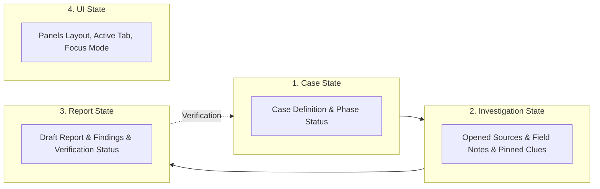

# 🏛️ Avi-Mystery — Tài Liệu Kiến Trúc Hệ Thống (System Architecture)

> **Mô tả:** Tài liệu kiến trúc toàn diện của Avi-Mystery, bao gồm phân vùng module, kiến trúc 4 miền trạng thái, hệ thống đa ngôn ngữ 3 tầng, sơ đồ quan hệ thực thể, thiết kế schema cơ sở dữ liệu và chiến lược kiểm thử tự động.

---

## 1. 🗺️ Tổng Quan Hạ Tầng & Công Nghệ (Tech Stack)

| Lớp kiến trúc | Công nghệ sử dụng | Vai trò & Mục đích |
|---|---|---|
| **Frontend Framework** | React 18, Vite 5 | SPA render tức thì, HMR < 50ms, bundling tối ưu |
| **Routing & Auth Guards** | React Router v6 | Điều hướng trang, phân quyền Role Guards (Guest / Learner / Admin) |
| **Design System** | Tailwind CSS 3, CSS Variables | Theme **Detective Amber** với bảng màu Light/Dark mode đa tầng |
| **Split-Pane Layout** | `react-resizable-panels` | Chia khung IDE tỷ lệ 34:66 chuẩn LeetCode / VS Code Web |
| **SQL Engine trên Browser** | `sql.js@1.14.2` (SQLite WASM) + Web Worker | Thực thi truy vấn SQL an toàn trong Worker, không cần backend |
| **Excel Engine trên Browser** | Custom Pure JS (`excelChecker.js`) | Chuẩn hóa cú pháp, tính toán hàm SUM, AVERAGE, IF, VLOOKUP... |
| **Editor Bảng Tính** | `CellEditorOverlay` (`createPortal`) | In-cell formula editor nổi, điều hướng Enter/Tab/Esc, zero re-render |
| **Hạ tầng Lưu trữ** | Firebase Firestore + LocalStorage (`storage.js`) | Lưu trữ tiến độ học tập, XP Ledger bất biến, cache offline IndexedDB |
| **Localization (i18n)** | `i18next`, `react-i18next` | Đa ngôn ngữ 3 tầng phản ứng tức thì (Runtime Reactivity) |
| **Test Framework** | Vitest 2, React Testing Library | **77 test suites, 592 tests PASS (100%)** |

---

## 2. 🧩 Kiến Trúc 4 Miền Trạng Thái Bàn Phân Tích (4 State Domains)

Không gian làm việc thám tử (`/cases/:caseId/investigate`) được xây dựng trên 4 miền trạng thái độc lập để tách biệt hoàn toàn logic vụ án khỏi công cụ hiển thị:



1. **Case State:** Quản lý bối cảnh vụ án, tiến trình các giai đoạn (Phase 1, Phase 2...), danh sách đối tượng và điều kiện mở khóa.
2. **Investigation State:** Quản lý các nguồn dữ liệu đang mở (Data tables, văn bản chứng từ, biên bản phỏng vấn nhân chứng), sổ tay ghi chú thực địa (Field Notes) và các manh mối được ghim (Pinned Clues).
3. **Report State:** Quản lý bản nháp báo cáo điều tra (Draft Report), các trường dữ liệu điều tra viên điền vào để gửi lên HQ kèm bằng chứng chứng minh.
4. **UI State:** Bố cục hiển thị thích ứng, trạng thái đóng/mở panel, chuyển đổi tab giữa Bằng chứng và Bàn làm việc.

---

## 3. 🌐 Kiến Trúc Đa Ngôn Ngữ 3 Tầng (3-Layer Localization Contract)

Để hỗ trợ song ngữ (Tiếng Việt `vi` và Tiếng Anh `en`) mà không làm hỏng dữ liệu nghiệp vụ:

| Tầng kiến trúc | Phạm vi trách nhiệm | Công nghệ | Nguyên tắc chuyển đổi |
|---|---|---|---|
| **Tầng A: Application UI** | Điều hướng, nút bấm, nhãn thanh công cụ, tooltip, dialog | `i18next` + `react-i18next` | Quản lý theo 4 namespaces (`nav`, `investigation`, `workbench`, `common`). Đổi ngôn ngữ cập nhật tức thì. |
| **Tầng B: Case Presentation** | Cốt truyện vụ án, lời khai nhân chứng, tiêu đề chứng cứ, câu hỏi báo cáo | `caseLocalizationService.js` | Dữ liệu gốc bất biến song ngữ `{ en, vi }`. Tự động resolve ra view tương ứng theo ngôn ngữ người dùng. |
| **Tầng C: Domain & Verification** | Giá trị bảng tính, ID mã vụ án, giá trị kiểm định (`rules[].expected`) | Raw values / Verification Engine | **BẢO LƯU 100% NGUYÊN BẢN.** Không dịch số liệu hoặc ID (`ORD-1842`, `4210`) để tránh lỗi so khớp kết quả. |

---

## 4. 🗂️ Phân Phối Module & Quyền Sở Hữu (Module Map)

| Module ID | Tên Module | Trách nhiệm | Đường dẫn thực tế |
|---|---|---|---|
| `SHR` | Shared UI & Layouts | UI Primitives, Layouts, Topbar, Modals, Brand Tokens | `src/components/ui/`, `src/app/layouts/` |
| `LRN-DETECTIVE` | Detective Workspace | Bàn làm việc thám tử, CaseFile, Evidence, HQ Communication | `src/pages/learner/DetectiveWorkspacePage.jsx`, `src/components/detective/` |
| `LRN-SETTINGS` | Detective Profile & Settings | Hồ sơ điều tra viên, mật danh, giao diện & tùy chọn điều tra | `src/pages/learner/SettingsPage.jsx` |
| `LRN-EXCEL` | Excel Workspace | Lưới bảng tính, In-cell overlay, Formula bar, Checker | `src/components/excel/`, `src/utils/excelChecker.js` |
| `LRN-SQL` | SQL Workspace | SQLite WASM Worker, Query Editor, Result Viewer, Policy | `src/utils/sql/`, `src/workers/sql/`, `src/components/sql/` |
| `LRN-ACADEMY` | Academy & Sandbox | Khóa học W3Schools style, Sandbox tự do, Kỳ thi tốt nghiệp | `src/pages/learner/AcademyCoursePage.jsx`, `src/pages/learner/PracticeSandboxPage.jsx` |
| `GAME` | Game Progression | Leveling engine, XP Ledger, Achievements, Streak | `src/utils/game/levelingEngine.js`, `src/services/api/firebaseProgressService.js` |
| `ADM` | Admin Studio | Quản lý vụ án, editor trực quan, import CSV sinh schema DDL | `src/pages/admin/`, `src/services/contracts/adminContentService.js` |

---

## 5. 🗄️ Thiết Kế Cơ Sở Dữ Liệu Dự Kiến (Database Schemas)

Chuẩn bị sẵn sàng cho giai đoạn phát triển Backend Server (FastAPI + PostgreSQL):

### Bảng 1: `users` (Tài khoản & Hồ sơ Thám tử)
- `id` (UUID, PK)
- `email` (VARCHAR(255), UNIQUE, NOT NULL)
- `hashed_password` (VARCHAR(255), NOT NULL)
- `display_name` (VARCHAR(100), NOT NULL)
- `role` (VARCHAR(20), DEFAULT 'learner') — `super_admin`, `content_admin`, `learner`
- `total_xp` (INTEGER, DEFAULT 0)
- `current_level` (INTEGER, DEFAULT 1)
- `rank_title` (VARCHAR(50), DEFAULT 'Thám tử Tập sự')
- `current_streak` (INTEGER, DEFAULT 0)
- `theme_preference` (VARCHAR(10), DEFAULT 'dark')

### Bảng 2: `investigations` (Hồ Sơ Vụ Án)
- `id` (VARCHAR(64), PK) — e.g. `case-001`
- `title` (JSONB, NOT NULL) — `{ "vi": "Đường Dây Buôn Lậu...", "en": "Coffee Smuggling..." }`
- `case_brief` (JSONB, NOT NULL) — Tóm tắt hồ sơ bối cảnh
- `difficulty` (VARCHAR(20), NOT NULL) — `beginner`, `intermediate`, `advanced`
- `tool` (VARCHAR(20), NOT NULL) — `excel`, `sql`, `both`
- `status` (VARCHAR(20), DEFAULT 'draft') — `published`, `draft`, `archived`
- `order_index` (INTEGER, DEFAULT 0)

### Bảng 3: `datasets` (Bộ Dữ Liệu Nguồn Độc Lập)
- `id` (VARCHAR(64), PK) — e.g. `ds-coffee-smuggling`
- `name` (VARCHAR(255), NOT NULL)
- `tool` (VARCHAR(20), NOT NULL)
- `sqlite_ddl` (TEXT, NULLABLE) — Lệnh DDL tạo bảng SQLite
- `excel_grid_data` (JSONB, NULLABLE) — Ma trận dữ liệu ô tính
- `schema_metadata` (JSONB, NOT NULL) — Cấu trúc cột, kiểu dữ liệu

### Bảng 4: `xp_ledger` (Sổ Cái Điểm Thưởng Bất Biến - Idempotent)
- `id` (VARCHAR(64), PK)
- `user_id` (VARCHAR(64), FK users)
- `content_id` (VARCHAR(64), NOT NULL)
- `attempt_id` (VARCHAR(64), UNIQUE, NOT NULL) — **Khóa Idempotency chống lặp XP**
- `xp_amount` (INTEGER, NOT NULL)
- `reason` (VARCHAR(255), NOT NULL)
- `created_at` (TIMESTAMP WITH TIME ZONE, DEFAULT NOW())

---

## 6. 🧪 Chiến Lược Kiểm Thử Tự Động (Test Strategy)

Hệ thống tuân thủ mô hình Kim tự tháp Kiểm thử (Test Pyramid) nghiêm ngặt:

```text
               ▲
              / \     E2E Flow Tests (End-to-End Investigation Loop)
             /   \    
            /-----\   Integration Tests (Workspace to Service Gateway & Firestore)
           /       \  
          /---------\ Component Tests (FormulaBar, SpreadsheetGrid, EvidencePanel)
         /-----------\ Unit Tests (pure excelChecker, sqlChecker, levelingEngine)
```

- **Mệnh đề Zero Regression:** Toàn bộ test suite (`77 files, 592 tests`) phải đạt 100% PASS trước khi đóng bất kỳ Sprint/Step nào.
- **Lệnh chạy kiểm thử chuẩn:**
  ```bash
  npm test -- --run
  ```
- **Lệnh kiểm tra bản dựng Production:**
  ```bash
  npm run build
  ```
