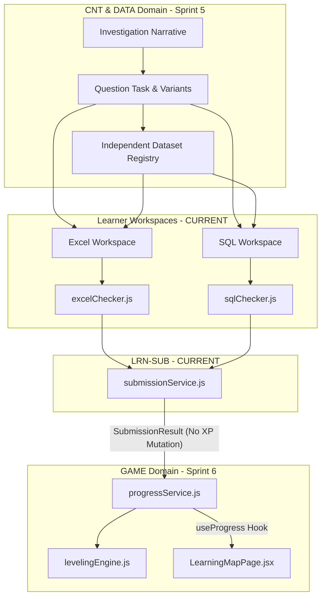

--- Content of docs/agent/MODULE_MAP.md ---

# Module Map & Area Ownership

> **Cập nhật lần cuối:** 24/08/2026
> **Mô tả:** Phân vùng trách nhiệm module, đường dẫn mã nguồn thực tế và ranh giới hệ thống.

---

## 1. 🗺 Bảng Phân Vùng Module Chi Tiết

| Module ID | Tên Module / Domain Owner | Trạng Thái Kiến Trúc | Đường Dẫn Thực Tế | Dependency Chính | Sprint Kế Hoạch |
|---|---|---|---|---|---|
| `SHR` | Shared UI & Contracts | `CURRENT` | `src/services/contracts/`, `src/components/ui/`, `src/app/layouts/` | Không phụ thuộc | Transversal |
| `LRN-EXCEL` | Excel Learner Workspace | `CURRENT` | `src/components/excel/`, `src/pages/learner/ExcelMissionPage.jsx`, `src/utils/excelChecker.js` | `SHR`, `LRN-SUB` | 1–3 |
| `LRN-SQL` | SQL Learner Workspace | `CURRENT` | `src/utils/sql/`, `src/workers/sql/`, `src/components/sql/`, `src/pages/learner/SqlMissionPage.jsx` | `SHR`, `LRN-SUB` | 4 |
| `LRN-SUB` | Submission Gateway | `CURRENT` | `src/services/contracts/submissionService.js`, `src/services/mock/mockSubmissionService.js` | `LRN-EXCEL`, `LRN-SQL` | 3–4 |
| `CNT` | Content Domain | `PLANNED` | `src/services/contracts/contentService.js` [PLANNED], `src/mocks/data/` | `SHR` | Sprint 5 |
| `DATA` | Dataset Domain | `PLANNED` | `src/services/contracts/datasetService.js` [PLANNED], `src/utils/sql/sqlDataset.js` | `SHR` | Sprint 5 |
| `GAME` | Game Progress Domain | `PLANNED` | `src/utils/game/levelingEngine.js` [PLANNED], `src/services/contracts/progressService.js` [PLANNED] | `LRN-SUB`, `SHR` | Sprint 6 |
| `ADM` | Admin Content Studio | `PROPOSED` | `src/pages/admin/` | `SHR`, `CNT` | Sprint 8 |
| `BE` | Backend API (FastAPI) | `PROPOSED` | `src/services/api/` [STUB] | Service Contracts | Sprint 9 |
| `ANL` | Analytics & Insights | `PROPOSED` | `/admin/analytics` [PLACEHOLDER] | `GAME`, `BE` | Sprint 10 |

---

## 2. 🔀 Sơ Đồ Phụ Thuộc Kiến Trúc Tương Lai (Architecture Dependency Graph)



---

## 3. 🚦 Quy Tắc Ranh Giới Module (Module Boundary Rules)

1. **Ranh Giới UI & Gateway (`UI Layering Rule`)**:
   - UI (`src/pages`, `src/components`) không được đọc trực tiếp mock JSON hay import mock adapters.
   - UI chỉ giao tiếp thông qua Service Gateway (`src/services/index.js`).

2. **Ranh Giới Evaluator & Progress (`Evaluator-Progress Rule`)**:
   - Evaluator (`excelChecker.js`, `sqlChecker.js`) là hàm thuần túy, không mutate XP hoặc lưu trữ trạng thái.
   - Progress Service (`GAME` Domain) sở hữu duy nhất quyền hạn trao điểm XP, thăng cấp và cập nhật mở khóa bài học.

3. **Ranh Giới Dataset (`Dataset Independence Rule`)**:
   - Bộ dữ liệu `Dataset` thuộc sở hữu của `DATA` Domain, độc lập với `missionId` hay `questionId`.

---

## 4. 🔗 Đường Dẫn Verified & Placeholders

| Feature Route | Tệp Render Chính | Module Ownership | Trạng Thái |
|---|---|---|---|
| `/courses` | `src/pages/learner/CoursesPage.jsx` | `LRN` | `CURRENT` |
| `/courses/:slug` | `src/pages/learner/CourseDetailPage.jsx` | `LRN` | `CURRENT` |
| `/map` | `src/pages/learner/LearningMapPage.jsx` | `LRN` / `GAME` | `CURRENT` (Static UI) → Dynamic `Sprint 6` |
| `/missions/:missionId` | `src/pages/learner/MissionIntroPage.jsx` | `LRN` / `CNT` | `CURRENT` |
| `/missions/:missionId/workspace` | `src/pages/learner/ExcelMissionPage.jsx` | `LRN-EXCEL` | `CURRENT` |
| `/missions/:missionId/sql` | `src/pages/learner/SqlMissionPage.jsx` | `LRN-SQL` | `CURRENT` |
| `/profile` | `src/app/router/index.jsx` | `GAME` | `PLANNED` (Placeholder) |
| `/achievements` | `src/app/router/index.jsx` | `GAME` | `PLANNED` (Placeholder) |
| `/admin/settings` | `src/pages/admin/PageStatusPage.jsx` | `ADM` | `CURRENT` |
| `/admin/courses` | Placeholder | `ADM` | `PROPOSED` |


--- Content of docs/agent/TEST_STRATEGY.md ---

# Test Strategy & Quality Assurance Architecture

> **Cập nhật lần cuối:** 24/08/2026
> **Mục tiêu:** Định hướng kiểm thử tự động, tiêu chuẩn regression test và quy định chạy test command theo từng phân vùng kiến trúc.

---

## 1. 🛠 Verified Test Tooling & Environment

- **Test Framework:** Vitest `^2.1.1` (local version `2.1.9`), React Testing Library `^16.0.0`, JSDOM environment.
- **Config Files:** `vite.config.js` (dùng `src/test/setup.js`) và `vitest.config.js` (dùng `src/tests/setup.js`). Giữ nguyên cấu hình hiện tại.

### Commands Chuẩn Khi Chạy Test:
```bash
# Chạy toàn bộ test suite (Non-watch mode)
npm test -- --run

# Targeted test cho Submission Gateway & Workspace
npm test -- --run src/services/mock/mockSubmissionService.test.js src/pages/learner/ExcelMissionPage.test.jsx src/pages/learner/SqlMissionPage.test.jsx

# Targeted test cho SQL Engine WASM & Policies
npm test -- --run src/utils/sql/sqlQueryPolicy.test.js src/utils/sql/sqlEngineAdapter.test.js src/utils/sql/sqlChecker.test.js
```

---

## 2. 🏛 Architectural Test Pyramid & Domain Boundaries

```text
               ▲
              / \     E2E Tests (Planned - Sprint 10)
             /   \    
            /-----\   Integration Tests (CURRENT - Workspace to Service Gateway)
           /       \  
          /---------\ Component Tests (CURRENT - SchemaBrowser, SqlEditor, FormulaBar)
         /-----------\ Unit Tests (CURRENT - pure excelChecker, sqlChecker, policy guards)
```

### Coverage Rule theo Module:
| Area | Module | Test Scope | Trạng Thái |
|---|---|---|---|
| `SHR` | Shared | UI primitives (`Button`, `Card`, `Skeleton`), RBAC route guards, Theme provider | `CURRENT` |
| `LRN-EXCEL` | Excel Workspace | `excelChecker.js` pure logic, `SpreadsheetGrid`, `FormulaBar`, `HintPanel` pin-to-fx | `CURRENT` |
| `LRN-SQL` | SQL Workspace | `sqlQueryPolicy.js` (12 keywords & multi-statement guard), SQLite Worker lifecycle, `SchemaBrowser`, `SqlEditor`, `ResultViewer`, `sqlChecker.js` | `CURRENT` |
| `LRN-SUB` | Submission Gateway | `submissionService` contract, `mockSubmissionService` mode `run`/`submit`, `clientAttemptId` replay guard, `potentialXp` preview (No XP mutation) | `CURRENT` |
| `CNT` | Content Domain | Content config extraction, `contentService` dynamic evaluation config loading | `PLANNED / Sprint 5` |
| `DATA` | Dataset Domain | Independent dataset registry loading & schema caching across questions | `PLANNED / Sprint 5` |
| `GAME` | Game Progress | Deterministic `levelingEngine.js` (Level 1–50), `progressService` idempotent XP ledger, dynamic `LearningMapPage` unlocking | `PLANNED / Sprint 6` |

---

## 3. 🎯 Specific Test Verification Rules

### 3.1. Submission Gateway Verification
- `run` mode: Trả về kết quả đánh giá công thức/query, `stepCompleted = false`, `potentialXp = 0`, không làm đổi state.
- `submit` mode: Trả về `stepCompleted`, `questionCompleted`, và `potentialXp` phần thưởng dự kiến. **Không mutate user XP**.
- `clientAttemptId`: Đảm bảo cùng một attempt ID không gửi request trùng lặp.
- Incorrect Answer: Trả về `feedbackCode` và `feedback` hiển thị inline UI, giữ nguyên câu trả lời người học đã gõ.

### 3.2. SQL WASM Engine Verification
- Security Guard: Bắt buộc test 100% các câu lệnh chứa `INSERT`, `UPDATE`, `DELETE`, `DROP`, `ALTER`, `CREATE`, `VACUUM`, `PRAGMA`, `ATTACH`, `DETACH` hoặc có dấu `;`.
- Execution Timeout: Giả lập query nặng hoặc Cartesian join để xác minh ngắt timeout 3000ms và tự tái tạo Worker.
- Row Cap: Xác minh câu lệnh trả về hơn 500 dòng bị cắt gọn kèm cờ `truncated: true`.

---

## 4. 📊 Last Verified Baseline (Sprint 4 Gate)

- **Total Tests:** 222+ tests pass 100% trên 30+ test files.
- **WASM Production Build Gate:** Vite build thành công, `.wasm` asset đóng gói chính xác, preview server hoạt động ổn định.
- **Zero Regression Rule:** Không được phép làm vỡ bất kỳ test case nào của các Sprint 1–4 trước khi đóng bất kỳ Step nào trong tương lai.


--- Content of docs/agent/INVESTIGATION_MAPPING.md ---

# Legacy Mission to Investigation Mapping Specification

This document details the exact field-level and architectural mapping between legacy `Mission` records and the new `Investigation` domain entities introduced in Sprint 5 (Step 5.3).

---

## Content Domain Hierarchy

```
Course
 └── Phase
      └── Chapter
           └── Investigation  (Narrative Learning Unit)
                └── Question  (Evaluation / Challenge Unit)
                     └── Dataset  (Reusable Shared Asset)
```

---

## Field Mapping Reference Table

| Legacy `Mission` Property | `Investigation` Property | Type | Description / Transformation |
| :--- | :--- | :--- | :--- |
| `id` (e.g. `mission-001`) | `legacyMissionId` | `string` | Preserved reference to legacy mission ID. |
| `id` (resolved via `contentIdentity`) | `investigationId` / `id` | `string` | Deterministic entity ID with prefix `inv-` (e.g. `inv-001`). |
| `chapterId` | `chapterId` | `string` | Domain reference to parent Chapter entity (e.g. `ch-001`). |
| `datasetId` | `datasetId` | `string` | Domain reference to reusable Dataset entity (`ds-001`, `sql-sales-v1`). |
| `title` | `title` | `string` | Display title of the investigation. |
| `story` / `description` | `narrative` / `story` | `string` | Detective narrative context surrounding the case. |
| `objective` | `objective` | `string` | Primary goal/objective of the investigation. |
| `orderIndex` | `ordering` / `orderIndex` | `number` | Display and sorting order within parent Chapter. |
| `status` | `status` | `string` | Availability status (`published`, `draft`). |
| (resolved graph) | `questionIds` | `string[]` | Array of child Question entity IDs (`['q-001']`). |
| `tool`, `difficulty` | `metadata` | `object` | Secondary metadata including engine type (`excel`/`sql`) and difficulty. |

---

## Legacy Graph Resolution Examples

1. **Excel Mission (`mission-001`)**:
   - `legacyMissionId`: `mission-001`
   - `investigationId`: `inv-001`
   - `chapterId`: `ch-001`
   - `datasetId`: `ds-001`
   - `questionIds`: `['q-001']`
   - `tool`: `excel`

2. **SQL Mission (`mission-010` / `sql-mission-01`)**:
   - `legacyMissionId`: `mission-010` (or `sql-mission-01`)
   - `investigationId`: `inv-010` (or `inv-sql-01`)
   - `chapterId`: `ch-004`
   - `datasetId`: `sql-sales-v1`
   - `questionIds`: `['q-010']`
   - `tool`: `sql`

---

## Architectural Guarantees
- **No Data Duplication**: Datasets are referenced by `datasetId` and not embedded inside Investigation objects.
- **Backward Compatibility**: Existing Mission-based components and tests continue working unaffected while new features target the `Investigation` contract.


--- Content of docs/agent/QUESTION_MAPPING.md ---

# Legacy Step / Mission to Question Mapping Specification

This document details the exact field-level and architectural mapping between legacy `Mission` / `Step` records and the new `Question` domain entities introduced in Sprint 5 (Step 5.4).

---

## Architectural Responsibility Separation

```
┌────────────────────────────────────────────────────────┐
│ Question Domain Entity                                 │
│ - Describes learning content & metadata ONLY           │
│ - Contains prompt, checkerConfig, hints, reward config │
│ - DOES NOT execute evaluator or grant XP               │
└────────────────────────────────────────────────────────┘
                           │
                           ▼
┌────────────────────────────────────────────────────────┐
│ Submission Service                                     │
│ - Evaluates attempt against checkerConfig              │
│ - Returns submission evaluation result                 │
└────────────────────────────────────────────────────────┘
                           │
                           ▼
┌────────────────────────────────────────────────────────┐
│ Progress & Reward Service                              │
│ - Records learner state                                │
│ - Grants XP & unlocks next Question / Investigation    │
└────────────────────────────────────────────────────────┘
```

---

## Field Mapping Reference Table

| Legacy `Mission` / `Step` Property | `Question` Property | Type | Description / Transformation |
| :--- | :--- | :--- | :--- |
| `id` (resolved via `contentIdentity`) | `questionId` / `id` | `string` | Deterministic entity ID with prefix `q-` (e.g. `q-001`). |
| (resolved graph) | `investigationId` | `string` | Parent Investigation entity ID (`inv-001`). |
| `datasetId` | `datasetId` | `string` | Domain reference to reusable Dataset entity (`ds-001`, `sql-sales-v1`). |
| (topic / category) | `skillId` | `string` | Skill identity taxonomy (`skill-excel-formula`, `skill-sql-select`). |
| `difficulty` | `difficulty` | `string` | Difficulty level (`beginner`, `intermediate`, `advanced`). |
| `tool` | `type` | `string` | Assessment type (`excel_formula`, `sql_query`, `multiple_choice`). |
| `task` / `description` | `prompt` | `string` | Question prompt / instruction given to the learner. |
| `targetCell`, `expectedResult`, `initialFormula` | `checkerConfig` | `object` | Evaluation criteria (target cell, expected answer, starter content). |
| `hint` | `hints` | `array` | Unlockable hints array (`[{ id: 'hint-1', text: '...' }]`). |
| `reward` / `xp` | `rewards` | `object` | Static reward metadata (`{ baseXp: 100 }`). |
| `id` (legacy) | `legacyMissionId` | `string` | Preserved reference to legacy mission ID (`mission-001`). |

---

## Legacy Graph Resolution Examples

1. **Excel Mission Question (`mission-001` -> `q-001`)**:
   - `questionId`: `q-001`
   - `investigationId`: `inv-001`
   - `datasetId`: `ds-001`
   - `type`: `excel_formula`
   - `prompt`: "Tính tổng doanh thu..."
   - `checkerConfig`: `{ targetCell: 'D10', expectedResult: 15000, initialFormula: '=SUM(...)' }`
   - `hints`: `[{ id: 'hint-1', text: 'Sử dụng hàm SUM' }]`
   - `rewards`: `{ baseXp: 100 }`
   - `legacyMissionId`: `mission-001`

2. **SQL Mission Question (`mission-010` -> `q-010`)**:
   - `questionId`: `q-010`
   - `investigationId`: `inv-010`
   - `datasetId`: `sql-sales-v1`
   - `type`: `sql_query`
   - `prompt`: "Truy vấn danh sách đơn hàng..."
   - `checkerConfig`: `{ expectedResult: [...], allowedTables: ['orders'] }`
   - `hints`: `[{ id: 'hint-1', text: 'Sử dụng SELECT * FROM orders' }]`
   - `rewards`: `{ baseXp: 100 }`
   - `legacyMissionId`: `mission-010`

---

## Architectural Guarantees
- **Pure Content Descriptor**: Question entity is strictly read-only content metadata.
- **Independent Evaluation**: Evaluation and XP rewarding remain in Submission and Progress services.
- **Backward Compatibility**: Legacy Mission/Step workspaces continue operating using the same data sources.


--- Content of docs/agent/modules/ADM.md ---

# ADM — Admin Content

## Responsibility

Course, chapter, mission, dataset, test-case builder, preview, content lifecycle và publish validation.

## Non-responsibility

Không đánh giá learner attempt, không trao progress/XP và không bypass shared schema/contract.

## Current Status

- Partial
- Related Sprint: 6
- Verified Paths: Admin shell/status/settings tồn tại tại `src/pages/admin/` và `src/app/layouts/AdminLayout.jsx`; content routes trong `src/app/router/index.jsx` chỉ là placeholder; chưa có Content Builder source.

## Public Interfaces

Hiện có admin overview/page-status/settings UI. Course/chapter/mission/dataset authoring and publish APIs: TBD.

## Dependencies

SHR UI, auth/RBAC, mission/course/dataset contracts. Preview có thể reuse learner renderer qua public boundary, không ghi learner progress.

## Allowed Write Paths

- Existing admin shell ownership: `src/pages/admin/`, `src/app/layouts/AdminLayout.jsx`.
- Content Builder chưa có path được duyệt; task Sprint 6 phải thu hẹp path cụ thể.

## Read-only Paths

- `src/services/contracts/`
- `src/mocks/data/`
- `src/components/ui/`
- `src/app/router/index.jsx`

## Forbidden Scope

Mọi Admin Content change trong Sprint 3.4; learner submission/progress, SQL engine và backend source.

## Domain Rules

- Course/chapter/mission/dataset/test-case phải qua shared contract.
- Preview không ghi progress hoặc trao XP.
- Publish cần validation rõ; draft/published lifecycle không được bypass.
- Expected answer/test case không được lộ vào learner component.

## Required Test Coverage

RBAC, create/edit validation, lifecycle transitions, preview isolation, publish blocking và contract round-trip khi được triển khai.

## Definition of Done

- [ ] Acceptance Criteria đạt.
- [ ] Test module pass.
- [ ] Regression liên quan pass.
- [ ] Không sửa ngoài scope.
- [ ] Documentation được cập nhật nếu contract thay đổi.

## Known Risks

Admin status/settings hiện tồn tại nhưng dễ bị hiểu nhầm là Content Builder đã có; các content routes chỉ là placeholder.

## Open Questions

Draft schema, validation ownership, versioning, preview sandbox và publish permissions: TBD.


--- Content of docs/agent/modules/ANL.md ---

# ANL — Analytics & Hardening

## Responsibility

Event taxonomy, admin reporting, performance, security hardening, observability và launch readiness.

## Non-responsibility

Không thu thập dữ liệu nhạy cảm không cần thiết, không định nghĩa metric chỉ bằng chart và không sửa core feature ngoài task.

## Current Status

- Planned
- Related Sprint: 8
- Verified Paths: `/admin/analytics` là placeholder trong `src/app/router/index.jsx`; không có analytics/security/observability module source.

## Public Interfaces

TBD. Cần event schema/version, metric definitions, reporting contract và privacy/retention rules.

## Dependencies

Frontend event producers, BE authoritative data và SHR contracts. Feature module không được phụ thuộc chặt vào analytics transport.

## Allowed Write Paths

Không có source path được duyệt. Task Sprint 8 phải phê duyệt path/event boundary cụ thể.

## Read-only Paths

- `src/app/router/index.jsx`
- `src/pages/admin/OverviewPage.jsx`
- `docs/agent/CONTRACTS.md`

## Forbidden Scope

Mọi analytics/hardening implementation trong Sprint 3.4; sensitive-data collection; feature refactor không phục vụ metric/security acceptance criteria.

## Domain Rules

- Mỗi metric có tên, định nghĩa, numerator/denominator, nguồn và thời gian tính.
- Không thu dữ liệu nhạy cảm nếu không cần.
- Event taxonomy ổn định/versioned; dashboard không là nguồn sự thật.
- Security findings không tự cấp quyền sửa ngoài Current Task.

## Required Test Coverage

Event schema, deduplication, metric calculation, authorization/privacy, performance budgets và security regression khi được triển khai.

## Definition of Done

- [ ] Acceptance Criteria đạt.
- [ ] Test module pass.
- [ ] Regression liên quan pass.
- [ ] Không sửa ngoài scope.
- [ ] Documentation được cập nhật nếu contract thay đổi.

## Known Risks

Không có event instrumentation, backend reporting source, metric dictionary hoặc monitoring stack.

## Open Questions

Event transport, retention/consent, metric owners, performance budgets, threat model và launch gate: TBD.


--- Content of docs/agent/modules/BE.md ---

# BE — Backend API

## Responsibility

FastAPI, PostgreSQL, authentication, persistence, migrations và server-authoritative submission/progress rules từ Sprint 7.

## Non-responsibility

Không sở hữu learner/admin UI và không thay đổi public service interface tùy tiện.

## Current Status

- Planned
- Related Sprint: 7
- Verified Paths: không có backend source; `src/services/api/index.js` là frontend stub và chưa implement.

## Public Interfaces

Target REST/API mapping phải implement same frontend service interfaces như mock. Endpoint, schemas, auth mechanism và backend layout: TBD.

## Dependencies

SHR/domain contracts; server persistence. Frontend API client phụ thuộc backend API, không để backend phụ thuộc UI component.

## Allowed Write Paths

Không có backend source path được duyệt. Task Sprint 7 phải phê duyệt cấu trúc trước khi tạo source, config hoặc migration.

## Read-only Paths

- `src/services/contracts/`
- `src/services/mock/`
- `src/services/api/index.js`
- `src/services/index.js`
- `docs/agent/CONTRACTS.md`

## Forbidden Scope

Mọi backend/API implementation hoặc migration trong Sprint 3.4; database/user data; UI rewrite; package/config changes chưa duyệt.

## Domain Rules

- Chỉ triển khai từ Sprint 7 nếu Current Task không ghi khác.
- API client bảo toàn interface/mapping đã dùng bởi Mock Service.
- Server là nguồn sự thật cuối cho XP và submission persistence.
- Reward/persistence transaction phải idempotent; không đưa secret vào source/docs.

## Required Test Coverage

Contract tests mock/API, auth/RBAC, validation, authoritative evaluation, idempotent reward transaction, migrations, persistence integration và frontend compatibility.

## Definition of Done

- [ ] Acceptance Criteria đạt.
- [ ] Test module pass.
- [ ] Regression liên quan pass.
- [ ] Không sửa ngoài scope.
- [ ] Documentation được cập nhật nếu contract thay đổi.

## Known Risks

Backend stack chỉ được nêu trong roadmap/prompt; chưa có source, schema, migration strategy hoặc server test framework.

## Open Questions

Repository layout, ORM/migration tool, auth/token strategy, endpoint versioning và deployment topology: TBD.


--- Content of docs/agent/modules/GAME.md ---

# GAME — Game Progress

## Responsibility

Frontend domain duy nhất điều phối XP, level, streak, unlock và achievements; đảm bảo reward idempotency.

## Non-responsibility

Không đánh giá formula/query, không render animation làm nguồn sự thật, không sở hữu submission transport.

## Current Status

- Partial
- Related Sprint: 5
- Verified Paths: chưa có module riêng; XP/level/streak fields tại `src/services/contracts/authService.js` và mock auth data; `/profile` và `/achievements` là placeholder. Submission Step 3.4 không mutate XP.

## Public Interfaces

TBD. Cần Progress service/store nhận eligible completion và trả authoritative progress snapshot.

## Dependencies

LRN-SUB result/attempt identity và SHR contracts/storage adapter. Không phụ thuộc trực tiếp React component.

## Allowed Write Paths

Không có source path module độc lập được duyệt. Task Sprint 5 phải phê duyệt path cụ thể; code XP rải hiện tại không cấp quyền mặc định.

## Read-only Paths

- `src/services/contracts/authService.js`
- `src/services/mock/mockAuthService.js`
- `src/services/mock/mockSubmissionService.js`
- `src/app/router/index.jsx`

## Forbidden Scope

Mọi thay đổi Sprint 5 khi Current Task là Sprint 3.4; evaluator, Admin, SQL engine và backend persistence.

## Domain Rules

- Chỉ GAME/Progress điều phối XP/level/streak/achievement ở frontend domain.
- Một completion chỉ nhận thưởng một lần; animation không là nguồn sự thật.
- Sprint 3.4 chỉ nhận `potentialXp`, chưa trao XP.
- Backend Sprint 7 là authority cuối cùng cho reward/persistence.

## Required Test Coverage

Duplicate/replay reward, level thresholds, zero/negative rewards, unlock sequence, streak timezone/race rules và progress snapshot consistency.

## Definition of Done

- [ ] Acceptance Criteria đạt.
- [ ] Test module pass.
- [ ] Regression liên quan pass.
- [ ] Không sửa ngoài scope.
- [ ] Documentation được cập nhật nếu contract thay đổi.

## Known Risks

Progress/reward domain chưa được triển khai; Sprint 5 vẫn phải chốt completion key và idempotent award trước khi mutate XP.

## Open Questions

Reward key, level formula, streak timezone, hint penalty ownership và offline reconciliation: TBD.


--- Content of docs/agent/modules/LRN-EXCEL.md ---

# LRN-EXCEL — Excel Learning

Allowed paths ở đây mô tả ownership; task đang hoạt động vẫn phải bị thu hẹp bởi [CURRENT_TASK.md](../CURRENT_TASK.md).

## Responsibility

Formula input, workbook/worksheet state, grid interaction, Excel evaluator và learner feedback riêng cho Excel.

## Non-responsibility

Không điều phối generic submission attempt, không lưu/trao XP, không triển khai SQL hoặc backend persistence.

## Current Status

- Existing
- UI stabilization: DONE qua Step 3.6G
- Related Sprint: 1–3
- Verified Paths: `src/components/excel/`; `src/pages/learner/ExcelMissionPage.jsx`; `src/pages/learner/ExcelMissionPage.test.jsx`; `src/utils/excelChecker.js`; `src/utils/excelChecker.test.js`

## Public Interfaces

- `ExcelMissionPage` tại route `/missions/:missionId/workspace`.
- `FormulaBar`, `SpreadsheetGrid`, `ActionToolbar`, `HintPanel`, `MissionResultModal`.
- `normalizeFormula`, `analyzeExcelFormula`, `evaluateFormulaValue`, `checkExcelAnswer` và `EXCEL_FORMULA_ERROR_CODES` từ `excelChecker.js`.

## Dependencies

Được phụ thuộc SHR mission/dataset/service contracts, UI primitives và LRN-SUB submission interface. Không phụ thuộc GAME implementation.

## Allowed Write Paths

- `src/components/excel/`
- `src/pages/learner/ExcelMissionPage.jsx`
- `src/pages/learner/ExcelMissionPage.test.jsx`
- `src/utils/excelChecker.js`
- `src/utils/excelChecker.test.js`

## Read-only Paths

- `src/services/contracts/`
- `src/services/index.js`
- `src/services/mock/`
- `src/mocks/data/missions.json`
- `src/mocks/data/datasets.json`

## Forbidden Scope

SQL engine/workspace, Admin Content Builder, API/backend, progress/XP persistence và unrelated learner/admin pages.

## Domain Rules

- Không đưa expected answer vào component.
- Excel evaluator đánh giá đáp án nhưng không trao XP.
- `run` không hoàn thành nhiệm vụ.
- Giữ tương thích với [Submission Contract](../CONTRACTS.md).
- UI đi qua service gateway, không đọc mock JSON/import adapter trực tiếp.

## Required Test Coverage

Formula normalization/value/error, grid selection/edit/reset, run/hint states, target cell, integration với submission và giữ answer khi sai.

## Definition of Done

- [x] Acceptance Criteria của formula diagnostics đạt.
- [x] Test module pass.
- [x] Regression liên quan pass.
- [x] Không sửa ngoài scope.
- [x] Documentation được cập nhật theo diagnostic contract.
- [x] Global validator giữ mã lỗi ổn định và kiểm tra mọi công thức trong required range.
- [x] Reset/mission change không giữ inline hint stale.
- [x] Targeted 73/73, full regression 133/133 và production build pass.

## Known Risks

`ExcelMissionPage.jsx` vẫn chứa Excel state, submission orchestration và inline hint state ở cấp page; đây là debt kiến trúc dài hạn nhưng đã có integration coverage cho Reset, mission change và drawer keyboard focus. Fallback hint normalization vẫn tồn tại ở cả page và `HintPanel`, chỉ refactor khi có task riêng.

## Open Questions

Workbook multi-sheet state, cú pháp Excel nâng cao và boundary tách page/controller: TBD. Inline hint vẫn thuộc LRN-EXCEL cho đến khi có consumer thứ hai; không tự promote sang SHR.


--- Content of docs/agent/modules/LRN-SQL.md ---

# LRN-SQL — SQL Learning

## Responsibility

SQL engine adapter/Worker, schema browser, editor, query result viewer, SQL evaluator và learner feedback riêng cho SQL.

## Non-responsibility

Không trao XP, không chạy query trên backend trong Sprint 4, không quản lý Admin content hoặc Excel evaluator.

## Current Status

- DONE — Step 4.0: Technical Spike & SQL Contracts
- DONE — Step 4.1A: WASM Packaging & Worker Transport
- DONE — Step 4.1B: Database Lifecycle, Seed, Reset & Schema API
- DONE — Step 4.1C: Read-only Query Policy, Timeout & Row Limit
- DONE — Step 4.2: Schema Browser
- DONE — Step 4.3: SQL Mission Shell, Loader & Route (`/missions/:missionId/sql`)
- DONE — Step 4.4: SQL Editor MVP (`SqlEditor.jsx`)
- DONE — Step 4.5: Query Execution & Result Viewer (`ResultViewer.jsx`) & UX Polish
- DONE — Step 4.6: SQL Result Checker (`sqlChecker.js`)
- PLANNED — Step 4.7: SQL Submission Integration
- Related Sprint: 4
- Verified Paths: `src/components/sql/`, `src/utils/sql/`, `src/workers/sql/`, `src/pages/learner/SqlMissionPage.jsx`

## Proposed Public Interfaces

- `sqlEngine.initialize()`
- `sqlEngine.loadDataset(dataset)`
- `sqlEngine.getSchema()`
- `sqlEngine.execute(query, options)`
- `sqlEngine.reset()`
- `sqlEngine.dispose()`

Execution trả envelope ổn định chứa `columns`, `rows`, `rowCount`, `truncated`, `executionMs`, `errorCode` và `message`. Engine/Dataset/Execution baseline đã được Step 4.0 xác minh; Mission/Checker/Submission proposal được triển khai ở các Step tương ứng.

## Dependencies

Chỉ SHR contracts/UI/utilities và LRN-SUB public interface. Shared không được phụ thuộc ngược LRN-SQL.

## Allowed Write Paths

- `src/components/sql/`
- `src/utils/sql/`
- `src/workers/sql/`
- `src/pages/learner/SqlMissionPage.jsx`
- `src/pages/learner/SqlMissionPage.test.jsx`
- `src/services/mock/mockSqlService.js`
- `src/mocks/data/sql/`

## Read-only Paths

- `src/mocks/data/missions.json`
- `src/mocks/data/steps.json`
- `src/services/contracts/`
- `src/services/index.js`
- `src/app/router/index.jsx`

## Forbidden Scope

Backend query execution, XP/progress mutation, Admin Content Builder, Python sandbox, OPFS persistence trong MVP và thay đổi Excel evaluator.

## Domain Rules

- SQL chạy trong browser ở MVP Sprint 4; không gửi query lên backend.
- SQLite là dialect MVP; database nhỏ chạy in-memory và được dựng lại từ deterministic seed.
- Worker/engine cần timeout, row limit, reset database, dispose và stable error mapping.
- Timeout cứng phải có recovery strategy; không giả định `setTimeout` có thể ngắt WASM đang chạy đồng bộ.
- User query chỉ được đọc dữ liệu; internal schema query tách khỏi user-query policy.
- SQL evaluator không trao XP và không bypass Submission Contract.
- Query policy phía browser là UX protection, không phải security boundary cho reward/backend.

## Required Test Coverage

Fake adapter unit tests; Worker/WASM browser integration; engine isolation; read-only policy; timeout/recovery; max rows; reset/dispose; syntax/runtime mapping; deterministic result comparison; submission modes; production asset loading và full Excel regression.

## Definition of Done

- [x] Step 4.0 decision/contracts pass trước implementation.
- [ ] Mỗi Step 4.1A–4.8 đạt Acceptance Criteria riêng.
- [ ] Một SQL Mission chạy end-to-end mà không mutate XP.
- [ ] Security/resource/browser/build và full regression gates pass.
- [ ] Không sửa ngoài scope; contract changes được ghi rõ.

## Known Risks

- `sql.js@1.14.2` WASM engine, dedicated Worker, Schema Browser, product route (`/missions/:missionId/sql`), và SQL Editor MVP (`SqlEditor.jsx`) đã hoàn thiện trong Step 4.0–4.4.
- JSDOM không đại diện đầy đủ cho Worker/WASM; cần browser integration riêng.
- Read-only parsing, hard timeout/recovery và result equivalence (`NULL`, duplicate, order, tolerance) là các vùng risk cao.
- Editor dependency và route integration có thể làm tăng bundle hoặc ảnh hưởng Excel nếu không lazy-load/test boundary.

## Open Questions

Step 4.0 đã chốt engine package/version, Worker protocol, WASM asset path, schema format và error catalog. Canonical result comparison được giữ cho Step 4.6. CodeMirror/syntax highlighting là dependency gate riêng; controlled textarea là fallback MVP.


--- Content of docs/agent/modules/LRN-SUB.md ---

# LRN-SUB — Submission & Feedback

Allowed paths ở đây mô tả ownership; [CURRENT_TASK.md](../CURRENT_TASK.md) là quyền ghi thực tế.

## Responsibility

Orchestration `run`/`submit`, async state, attempt identity/count, validation/result mapping, double-submit guard, retry và feedback presentation.

## Non-responsibility

Không tự đánh giá Excel/SQL khi evaluator riêng tồn tại; không trực tiếp trao XP, level-up hoặc persistence backend.

## Current Status

- Existing — Step 3.4 core và Step 3.4E UI stabilization `DONE`
- Related Sprint: 3.4
- Verified Paths: `src/services/contracts/submissionService.js`; `src/services/index.js`; `src/services/mock/mockSubmissionService*`; submission flow trong `src/pages/learner/ExcelMissionPage*`; `src/components/excel/ActionToolbar*`; `src/components/excel/MissionResultModal*`

Contract và gateway đã có. Mock lưu submission history nhưng không cập nhật session XP/level; UI chỉ gọi gateway.

## Public Interfaces

- `submissionService.submit(request)`.
- `submissionService.getSubmissionHistory(userId)`.
- Mock hiện thực interface; API placeholder giữ cùng interface và API thật thuộc Sprint 7.

## Dependencies

Được phụ thuộc LRN-EXCEL evaluator và SHR mission/content/contracts. SQL evaluator chỉ được dùng khi Sprint 4 tạo module đó. Không phụ thuộc GAME internals.

## Allowed Write Paths

- `src/services/contracts/submissionService.js`
- `src/services/mock/mockSubmissionService.js`
- `src/services/mock/mockSubmissionService.test.js`
- `src/services/index.js`
- `src/pages/learner/ExcelMissionPage.jsx`
- `src/pages/learner/ExcelMissionPage.test.jsx`
- `src/components/excel/ActionToolbar.jsx`
- `src/components/excel/ActionToolbar.test.jsx`
- `src/components/excel/FormulaBar.jsx`
- `src/components/excel/FormulaBar.test.jsx`
- `src/components/excel/MissionResultModal.jsx`
- `src/components/excel/MissionResultModal.test.jsx`

## Read-only Paths

- `src/utils/excelChecker.js`
- `src/services/contracts/missionService.js`
- `src/services/mock/mockMissionService.js`
- `src/services/mock/mockAuthService.js`
- `src/mocks/data/missions.json`
- `src/mocks/data/datasets.json`
- `src/mocks/data/steps.json`

## Forbidden Scope

XP mutation/leveling/streak/achievement, SQL engine, Admin Content Builder, API implementation, FastAPI/PostgreSQL, package/config changes.

## Domain Rules

- Một task chỉ có LRN-SUB làm Primary Module; SHR chỉ được sửa ở path cụ thể trong Current Task.
- `run` không complete; chỉ `submit` có thể trả completion.
- Trả `potentialXp`, không cập nhật XP.
- Chặn double submit ở UI và giữ service idempotency-ready.
- Giữ answer sau incorrect/service error; feedback sai dùng inline, modal ưu tiên completion.
- Component không giữ expected answer; mock/API cùng public interface.
- Formula diagnostic code từ LRN-EXCEL được giữ nguyên trong `feedbackCode` để Run/Submit nhất quán.

## Required Test Coverage

Success, incorrect, validation error, service error, retry, optional timeout, double submit, unmount in-flight, `run` không complete và không XP mutation.

## Step 3.4 Core Definition of Done

- [x] Acceptance Criteria đạt.
- [x] Test module pass.
- [x] Regression liên quan pass.
- [x] Không sửa ngoài scope.
- [x] Documentation được cập nhật theo contract.

## Step 3.4E Stabilization Gate

- [x] Feedback/loading/retry states được xác minh lại.
- [x] Modal và submission area đạt responsive/accessibility gate.
- [x] Targeted test và full regression pass.
- [x] Không mở rộng sang Sprint 4 hoặc thay đổi Submission Contract.

## Known Risks

Checker config hiện được xác minh cho `mission-001`; mission Excel khác vẫn trả `CONTENT_CONFIG_MISSING` theo contract. Wording UI dùng “Phần thưởng dự kiến”; reward idempotency/XP mutation vẫn thuộc Sprint 5/7.

## Open Questions

SQL answer union và completion/versioning đa-step sẽ được chốt khi Sprint 4 được kích hoạt; không nằm trong Step 3.4.


--- Content of docs/agent/modules/SHR.md ---

# SHR — Shared Contracts/UI

## Responsibility

Stable service/domain contracts, service gateway, reusable UI primitives, hooks/utilities và mock fixtures/adapters thật sự dùng chung.

## Non-responsibility

Không là nơi chứa code chưa biết đặt đâu; không sở hữu feature workflow, evaluator-specific UI hoặc XP progression.

## Current Status

- Existing
- Learner UI foundation stabilization: Planned for Step 3.5
- Related Sprint: Xuyên suốt
- Verified Paths: `src/services/contracts/`; `src/services/index.js`; `src/components/ui/`; `src/hooks/`; `src/utils/`; `src/mocks/`; shared providers/layout/router tại `src/app/`

## Public Interfaces

- Auth/course/mission JSDoc contracts và service gateway exports.
- Reusable UI primitives (`Button`, `Card`, `Input`, `Badge`, `Skeleton`, `EmptyState`).
- Shared hooks/utilities/storage; exact public barrel strategy: TBD.

## Dependencies

Platform/library dependencies và stable domain primitives only. SHR không phụ thuộc ngược LRN-EXCEL, LRN-SUB, LRN-SQL, GAME, ADM, BE hoặc ANL.

## Allowed Write Paths

- `src/services/contracts/`
- `src/services/index.js`
- `src/components/ui/`
- `src/hooks/`
- `src/utils/`
- `src/mocks/`
- `src/app/layouts/`
- `src/app/router/`

## Read-only Paths

- Mọi feature consumer bị ảnh hưởng bởi contract change.
- `src/pages/learner/`
- `src/pages/admin/`
- `src/components/excel/`

## Forbidden Scope

Feature behavior/refactor không cần cho contract, SQL/Admin/Backend/Analytics implementation và thay đổi consumer không được Current Task duyệt.

## Domain Rules

- Shared contract change phải liệt kê mọi consumer impact và path được sửa.
- UI không đọc mock JSON; adapter qua gateway.
- Mock/API cùng public interface.
- Shared không phụ thuộc feature module.
- Không đưa secret hoặc expected answer vào UI-facing contract.

## Required Test Coverage

Contract compatibility, adapter parity, UI primitive accessibility, hook cleanup và utility edge cases; chạy regression consumer liên quan.

## Definition of Done

- [ ] Acceptance Criteria đạt.
- [ ] Test module pass.
- [ ] Regression liên quan pass.
- [ ] Không sửa ngoài scope.
- [ ] Documentation được cập nhật nếu contract thay đổi.

## Known Risks

Submission đã export qua gateway và Excel Mission không import mock adapter trực tiếp. Learner Sidebar active-state logic hiện chưa có route-boundary test; Step 3.5 phải phân biệt shared layout/primitives với component chỉ dùng cho Excel. `src/utils/excelChecker.js` vẫn là logic feature-specific dù nằm trong `utils`.

## Open Questions

Vị trí lâu dài của evaluators, contract runtime validation, barrel exports và ownership mock data: TBD.
