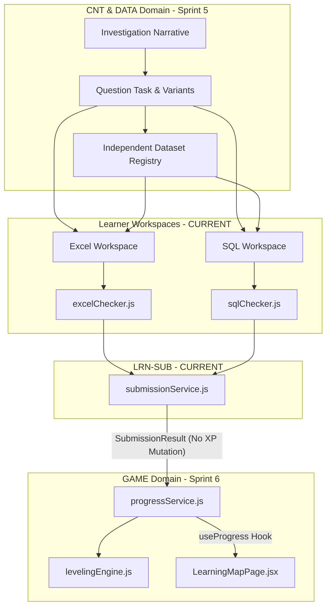

# Module Map & Area Ownership

> **Cập nhật lần cuối:** 24/08/2026
> **Mô tả:** Phân vùng trách nhiệm module, đường dẫn mã nguồn thực tế và ranh giới hệ thống.

---

## 1. 🗺 Bảng Phân Vùng Module Chi Tiết

| Module ID | Tên Module / Domain Owner | Trạng Thái Kiến Trúc | Đường Dẫn Thực Tế | Dependency Chính | Sprint Kế Hoạch |
|---|---|---|---|---|---|
| `SHR` | Shared UI & Contracts | `CURRENT` | `src/services/contracts/`, `src/components/ui/`, `src/app/layouts/` | Không phụ thuộc | Transversal |
| `LRN-EXCEL` | Excel Learner Workspace | `CURRENT` | `src/components/excel/`, `src/pages/learner/ExcelMissionPage.jsx`, `src/utils/excelChecker.js` | `SHR`, `LRN-SUB` | 1–3 |
| `LRN-SQL` | SQL Learner Workspace | `CURRENT` | `src/utils/sql/`, `src/workers/sql/`, `src/components/sql/`, `src/pages/learner/SqlMissionPage.jsx` | `SHR`, `LRN-SUB` | 4 |
| `LRN-SUB` | Submission Gateway | `CURRENT` | `src/services/contracts/submissionService.js`, `src/services/mock/mockSubmissionService.js` | `LRN-EXCEL`, `LRN-SQL` | 3–4 |
| `CNT` | Content Domain | `PLANNED` | `src/services/contracts/contentService.js` [PLANNED], `src/mocks/data/` | `SHR` | Sprint 5 |
| `DATA` | Dataset Domain | `PLANNED` | `src/services/contracts/datasetService.js` [PLANNED], `src/utils/sql/sqlDataset.js` | `SHR` | Sprint 5 |
| `GAME` | Game Progress Domain | `PLANNED` | `src/utils/game/levelingEngine.js` [PLANNED], `src/services/contracts/progressService.js` [PLANNED] | `LRN-SUB`, `SHR` | Sprint 6 |
| `ADM` | Admin Content Studio | `PROPOSED` | `src/pages/admin/` | `SHR`, `CNT` | Sprint 8 |
| `BE` | Backend API (FastAPI) | `PROPOSED` | `src/services/api/` [STUB] | Service Contracts | Sprint 9 |
| `ANL` | Analytics & Insights | `PROPOSED` | `/admin/analytics` [PLACEHOLDER] | `GAME`, `BE` | Sprint 10 |

---

## 2. 🔀 Sơ Đồ Phụ Thuộc Kiến Trúc Tương Lai (Architecture Dependency Graph)

---

## 3. 🚦 Quy Tắc Ranh Giới Module (Module Boundary Rules)

1. **Ranh Giới UI & Gateway (`UI Layering Rule`)**:
   - UI (`src/pages`, `src/components`) không được đọc trực tiếp mock JSON hay import mock adapters.
   - UI chỉ giao tiếp thông qua Service Gateway (`src/services/index.js`).

2. **Ranh Giới Evaluator & Progress (`Evaluator-Progress Rule`)**:
   - Evaluator (`excelChecker.js`, `sqlChecker.js`) là hàm thuần túy, không mutate XP hoặc lưu trữ trạng thái.
   - Progress Service (`GAME` Domain) sở hữu duy nhất quyền hạn trao điểm XP, thăng cấp và cập nhật mở khóa bài học.

3. **Ranh Giới Dataset (`Dataset Independence Rule`)**:
   - Bộ dữ liệu `Dataset` thuộc sở hữu của `DATA` Domain, độc lập với `missionId` hay `questionId`.

---

## 4. 🔗 Đường Dẫn Verified & Placeholders

| Feature Route | Tệp Render Chính | Module Ownership | Trạng Thái |
|---|---|---|---|
| `/courses` | `src/pages/learner/CoursesPage.jsx` | `LRN` | `CURRENT` |
| `/courses/:slug` | `src/pages/learner/CourseDetailPage.jsx` | `LRN` | `CURRENT` |
| `/map` | `src/pages/learner/LearningMapPage.jsx` | `LRN` / `GAME` | `CURRENT` (Static UI) → Dynamic `Sprint 6` |
| `/missions/:missionId` | `src/pages/learner/MissionIntroPage.jsx` | `LRN` / `CNT` | `CURRENT` |
| `/missions/:missionId/workspace` | `src/pages/learner/ExcelMissionPage.jsx` | `LRN-EXCEL` | `CURRENT` |
| `/missions/:missionId/sql` | `src/pages/learner/SqlMissionPage.jsx` | `LRN-SQL` | `CURRENT` |
| `/profile` | `src/app/router/index.jsx` | `GAME` | `PLANNED` (Placeholder) |
| `/achievements` | `src/app/router/index.jsx` | `GAME` | `PLANNED` (Placeholder) |
| `/admin/settings` | `src/pages/admin/PageStatusPage.jsx` | `ADM` | `CURRENT` |
| `/admin/courses` | Placeholder | `ADM` | `PROPOSED` |
