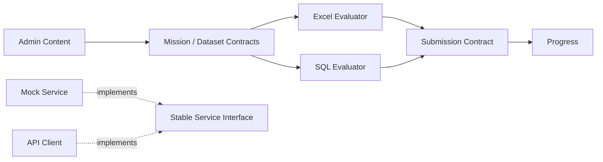

# Module Map

Trạng thái phản ánh source đã xác minh, không phản ánh riêng checkbox roadmap.

| Module ID | Module / owner trách nhiệm | Trạng thái | Đường dẫn thật | Dependency chính | Sprint |
|---|---|---|---|---|---|
| `LRN-EXCEL` | Excel Learning | Existing; Step 3.6G stabilization Done | `src/components/excel/`; `src/pages/learner/ExcelMissionPage*`; `src/utils/excelChecker*` | SHR, LRN-SUB | 1–3.6G |
| `LRN-SUB` | Submission & Feedback | Existing; Step 3.4E Done | `src/services/contracts/submissionService.js`; `src/services/index.js`; `src/services/mock/mockSubmissionService*`; submit flow trong `ExcelMissionPage*`; `MissionResultModal*`; `ActionToolbar*` | LRN-EXCEL, SHR | 3.4–3.4E |
| `LRN-SQL` | SQL Learning | Planned | Không có module source; chỉ có SQL records trong `src/mocks/data/missions.json` và `steps.json` | SHR, LRN-SUB | 4 |
| `GAME` | Game Progress | Partial | Chưa có module riêng; XP/level fields hiện chỉ nằm ở `authService`/auth mock, không do Submission mutate | LRN-SUB, SHR | 5 |
| `ADM` | Admin Content | Partial | `src/pages/admin/`; `src/app/layouts/AdminLayout.jsx`; content routes hiện là placeholder | SHR | 6 |
| `BE` | Backend API | Planned | `src/services/api/index.js` chỉ là frontend API stub; không có backend source | SHR contracts | 7 |
| `ANL` | Analytics & Hardening | Planned | `/admin/analytics` là placeholder trong router; không có module source | Frontend, BE | 8 |
| `SHR` | Shared Contracts/UI | Existing; Sprint 3 stabilization Done | `src/services/contracts/`; `src/services/index.js`; `src/components/ui/`; `src/hooks/`; `src/utils/`; `src/mocks/`; shared layout tại `src/app/layouts/` | Không phụ thuộc feature module | Xuyên suốt |

## Dependency Direction

- Excel evaluator đánh giá formula/value; SQL evaluator sẽ đánh giá result set. Submission điều phối mode, attempt và feedback, không tự sở hữu logic evaluator khi adapter riêng tồn tại.
- `GAME`/Progress là frontend domain duy nhất điều phối XP, level, streak và achievements. Progress không phụ thuộc trực tiếp UI component.
- Backend Sprint 7 là nguồn sự thật cuối cùng cho XP và persisted submission; API client phải map về cùng interface như mock.
- Shared không phụ thuộc ngược feature module.

## Verified Routes and Entry Points

| Area | Route/entry point | Status |
|---|---|---|
| Learner Excel | `/missions/:missionId/workspace` → `ExcelMissionPage` | Existing |
| Learner navigation | `LearnerLayout` active state, gồm `/missions/*` → `/map` | Existing; segment-boundary test pass |
| Learner mission | `/missions/:missionId` → `MissionIntroPage` | Existing |
| Learner SQL | Không có route riêng | Planned |
| Game | `/profile`, `/achievements` | Placeholder |
| Admin shell | `/admin`, `/admin/pages`, `/admin/settings` | Existing |
| Admin content | `/admin/courses`, `/admin/chapters`, `/admin/missions`, `/admin/datasets` | Placeholder |
| Analytics | `/admin/analytics` | Placeholder |
| Service gateway | `src/services/index.js` | Existing; đã export submission service |

## Module Documents

[LRN-EXCEL](./modules/LRN-EXCEL.md) · [LRN-SUB](./modules/LRN-SUB.md) · [LRN-SQL](./modules/LRN-SQL.md) · [GAME](./modules/GAME.md) · [ADM](./modules/ADM.md) · [BE](./modules/BE.md) · [ANL](./modules/ANL.md) · [SHR](./modules/SHR.md)
